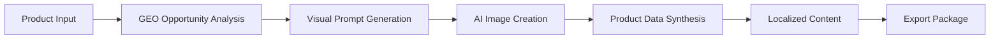

[](LICENSE)
[](requirements.txt)
[](SKILL.md)

<!-- DAGENO_AGENT_NAV_START -->

**Dageno Agent Project Map / Dageno Agent 项目导航**

Docs / 文档: [README](https://github.com/dageno-agents/geo-visual-content-engine) · [简体中文](https://github.com/dageno-agents/geo-visual-content-engine/blob/main/README.zh-CN.md)

If this repo is useful, you may also want the adjacent Dageno Agent projects for GEO, SEO, AI visibility, and content operations.
如果这个仓库对你有帮助，也可以看看这些相邻的 Dageno Agent 项目，用于 GEO、SEO、AI 可见性和内容增长工作流。

| If you want to... / 如果你想... | Project / 项目 | Plain-language difference / 白话区别 |
| --- | --- | --- |
| First diagnose a site / 先给网站做体检 | [seo-geo-audit](https://github.com/dageno-agents/seo-geo-audit) | Like an SEO + GEO medical report: technical issues, content gaps, trust signals, off-site mentions, and AI visibility in one audit / 像一份 SEO + GEO 体检报告，把技术问题、内容缺口、信任信号、站外提及和 AI 可见性放到一起看 |
| Turn a real website into Dageno topics and prompts / 把真实网站变成 Dageno 监控题库 | [dageno-online-topic-prompt-generator](https://github.com/dageno-agents/dageno-online-topic-prompt-generator) | Crawls the site and studies the business first, then generates Topic clusters and high-intent Prompts. Not an industry-template prompt dump / 先看网站和业务，再生成 Topic 集群和高意图 Prompt，不是套行业模板 |
| Produce SEO/GEO articles from keywords or briefs / 从关键词或 brief 批量生产内容 | [seo-geo-content-engine](https://github.com/dageno-agents/seo-geo-content-engine) | A full content pipeline: research, SERP intent, article structure, draft, metadata, FAQ, and GEO packaging / 完整内容流水线：调研、搜索意图、文章结构、正文、metadata、FAQ 和 GEO 包装 |
| Write from Dageno fanout data / 用 Dageno fanout 写文章 | [geo-content-writer](https://github.com/dageno-agents/geo-content-writer) | For when Dageno already found prompt opportunities: turn fanout into a backlog, editorial brief, draft contract, and review contract / 适合已经有 Dageno prompt opportunity 的情况：把 fanout 变成选题队列、编辑 brief、草稿契约和审核契约 |
| Find why organic content is not converting / 找出自然流量内容为什么不转化 | [organic-content-intelligence](https://github.com/dageno-agents/organic-content-intelligence) | Joins GSC, GA4, crawl, intent, and AI/GEO signals to show which pages have demand but fail to answer or convert / 把 GSC、GA4、抓取、意图和 AI/GEO 信号连起来，看哪些页面有需求但没有承接住 |
| Improve a site's GEO structure / 优化网站结构以适配 GEO | [geo-site-architecture-audit](https://github.com/dageno-agents/geo-site-architecture-audit) | Starts from the existing navigation, sitemap, landing pages, and help content, then finds missing AI-answerable pages and internal links / 从现有导航、站点地图、落地页和帮助内容出发，找缺失的 AI 可引用页面和内链结构 |
| Create a client-facing AI visibility report / 做给客户看的 AI 可见性报告 | [brand-ai-performance-check](https://github.com/dageno-agents/brand-ai-performance-check) | A stable visual report template for brand AI performance, using Dageno API data or custom inputs / 稳定的品牌 AI 表现可视化报告模板，可接 Dageno API 或自定义数据 |
| Automate Dageno in workflows / 把 Dageno 接进自动化流程 | [n8n-nodes-dageno](https://github.com/dageno-agents/n8n-nodes-dageno) | Use Dageno inside n8n: brands, GEO analysis, keywords, opportunities, topics, prompts, SEO, and citations / 在 n8n 里调用 Dageno：品牌、GEO 分析、关键词、机会、Topic、Prompt、SEO 和引用数据 |
| Learn the API and MCP growth workflow / 学 Dageno API 和 MCP 怎么用于增长 | [dageno-mcp-growth-playbook](https://github.com/dageno-agents/dageno-mcp-growth-playbook) | The practical playbook for turning Dageno API/MCP data into reports, prompt gaps, citation intelligence, and growth actions / 把 Dageno API/MCP 数据变成报告、Prompt Gap、引用分析和增长动作的实战手册 |

More projects / 更多项目: [geo-visual-content-engine](https://github.com/dageno-agents/geo-visual-content-engine), [seo-outreach-skill](https://github.com/dageno-agents/seo-outreach-skill), [geo-pre-sale-report-private](https://github.com/dageno-agents/geo-pre-sale-report-private), [GEO-SEO](https://github.com/dageno-agents/GEO-SEO).

Explore all repos / 查看全部项目: [github.com/dageno-agents](https://github.com/dageno-agents) · Product / 产品: [Dageno](https://dageno.ai/?utm_source=github&utm_medium=social&utm_campaign=official)

<!-- DAGENO_AGENT_NAV_END -->

# GEO Visual Content Engine


> Turn GEO opportunities into AI-generated product visuals, localized content, and export-ready commerce assets.

**Positioning**

GEO Visual Content Engine is built for commerce teams that want to move from product input to export-ready AI-native marketing assets in one flow.

It is designed to turn a product and keyword opportunity into:

- GEO-aware opportunity framing
- AI-generated product visuals
- localized content assets
- structured product data
- export-ready outputs for commerce platforms

This project helps answer a practical commerce question:

> How do you turn product opportunities into visual and content assets fast enough for AI-native discovery and commerce execution?

**Outcome**

Instead of splitting research, asset creation, product data generation, and store preparation into disconnected tools, this project combines them into one execution workflow.

**About Dageno.ai**

[Dageno.ai](https://dageno.ai) is an AI SEO platform for brands, DTC teams, agencies, and AI-search growth teams that want to connect product visibility, content generation, and AI-native commerce execution.

## Why It Feels Different

Most product content workflows break in the middle.

Teams often have:

- one process for product data
- another for image generation
- another for localization
- another for marketplace or store publishing

This project connects those layers so the workflow can end with assets that are ready to export or hand off, not just drafts that still need manual cleanup.

## What You Get

- one product-to-asset pipeline
- one structure for GEO opportunity analysis
- one system for AI-generated visuals
- one path to Shopify and WooCommerce asset packaging

## Who This Is For

- Shopify and DTC brands generating product assets at scale
- AI-first commerce operators launching search-ready product content
- agencies managing visual content workflows across markets or brands
- growth teams testing product narratives for AI-search and commerce channels

## Workflow



## What The System Produces

For one product and keyword input, the workflow can produce:

- GEO opportunity analysis
- product image prompts
- AI-generated product visuals
- titles, descriptions, SKU, pricing fields
- localized content variants
- export-ready outputs for Shopify and WooCommerce

## External Access And Minimum Credentials

This workflow can use three external systems:

- Google Gemini / Nano Banana 2 for image generation
- Shopify for optional direct export
- WooCommerce for optional direct export

Minimum credentials by action:

- `GOOGLE_API_KEY`: required for image generation
- `SHOPIFY_STORE_URL` + `SHOPIFY_ACCESS_TOKEN`: only required for direct Shopify export
- `WOOCOMMERCE_STORE_URL` + `WOOCOMMERCE_CONSUMER_KEY` + `WOOCOMMERCE_CONSUMER_SECRET`: only required for direct WooCommerce export

If store credentials are absent, the workflow should stop at analysis, visuals, product-data output, and export packaging instead of claiming live store access.

Access policy:

- image generation can run without any commerce credentials
- Shopify and WooCommerce direct export are optional, not required
- the workflow should not assume live store write access by default
- if direct export is not explicitly enabled, stop at asset, product-data, and export-package output

## Example Input

```json
{
  "brand": "AcmeWatch",
  "product": "Acme DivePro 5",
  "core_keyword": "smartwatch water resistance",
  "country": "us",
  "language": "en",
  "publish_to_shopify": false,
  "publish_to_woocommerce": false
}
```

## Example Output

```text
Opportunity Layer
- GEO opportunity identified around durability and water-resistance use cases

Asset Layer
- white-background product image
- lifestyle image
- hero image

Commerce Layer
- generated title
- generated description
- SKU and pricing fields
- publishing result for Shopify / WooCommerce
```

## Why Teams Use It

### Traditional Commerce Asset Workflow

- product data prepared manually
- visuals generated in a separate tool
- localization handled later
- publishing is still manual

### With GEO Visual Opportunity Engine

- research, assets, copy, and publishing live in one workflow
- the system starts with opportunity framing and ends with deployable outputs

## Entry Points

Core files:

- [`SKILL.md`](SKILL.md)
- [`src/main.py`](src/main.py)

Use this project when you want a product content workflow that connects GEO thinking with visual production and commerce execution.

## Repo Structure

```text
geo-visual-content-engine/
├── README.md
├── SKILL.md
├── assets/
│   └── cover.svg
├── src/
├── schemas/
├── prompts/
└── examples/
```

## Recommended Use Cases

- AI-generated product launch assets
- localized commerce content generation
- Shopify and WooCommerce publishing workflows
- GEO-driven visual experimentation for product pages

## License

MIT
